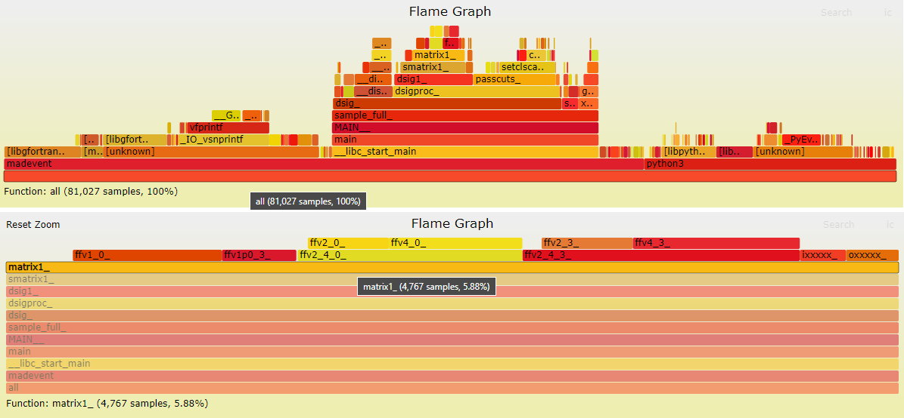

# MG5aMC eemumu gridpack

This directory contains a (modified) MG5aMC gridpack for ee to mumu.

It contains all relevant Fortran code including MadEvent and all relevant data files.

## MG5aMC version and installation (2021.03.09)

The gridpack was created from a MG5aMC 2.9.2 installation in
  /eos/home-a/avalassi/2021/MG5aMC/2.9.2/

This is based on the latest 2.9.2 tarball:
-  https://launchpad.net/mg5amcnlo/2.0/2.9.x/+download/MG5_aMC_v2.9.2.tar.gz

It is complemented with the following patches for a few python3 bugs:
-  https://bazaar.launchpad.net/~maddevelopers/mg5amcnlo/2.9.3/revision/307
-  https://bazaar.launchpad.net/~maddevelopers/mg5amcnlo/2.9.3/revision/308
-  https://bazaar.launchpad.net/~maddevelopers/mg5amcnlo/2.9.3/revision/310

## Python version

Python 3.8 was used from /cvmfs using the (setupPython38.sh)[setupPython38.sh] script.

## EEMUMU gridpack creation

The EEMUMU gridpack was created as follows

```
cd /eos/home-a/avalassi/2021/MG5aMC/2.9.2/
\rm -rf _EEMUMU
cat << EOF >> _EEMUMU.mg
generate e+ e- > mu+ mu-
output _EEMUMU
launch
set gridpack True
set ebeam1 750
set ebeam2 750
set ptl -1
set etal -1
set drll -1
{ time python3.8 ./bin/mg5_aMC -l DEBUG _EEMUMU.mg ; } >& _EEMUMU_log.txt
```

The [_EEMUMU_log.txt](_EEMUMU_log.txt) logfile has been copied to this directory.

The cross section computed during gridpack creation, originally displayed in _EEMUMU/HTML/run_01/results.html, is the following:

| Graph | Cross-Section (pb) | Error | Events (K) | Unwgt | Luminosity (pb^-1) |
| :--- | :--- | :--- | :--- | :--- | :--- |
| _EEMUMU/SubProcesses/P1_ll_ll | 0.046903 | 0.000144 | 28.02 | 1592.0 | 0 |

The breakdown for the two MadEvent channels is the following:

| Graph | Cross-Section (pb) | Error | Events (K) | Unwgt | Luminosity (pb^-1) |
| :--- | :--- | :--- | :--- | :--- | :--- |
| [_EEMUMU/SubProcesses/P1_ll_ll/G1](_EEMUMU/run01_G1_log.txt) | 0.02333 | 0.000131 | 14.01 | 798.0 | 3.42e+04 |
| [_EEMUMU/SubProcesses/P1_ll_ll/G2](_EEMUMU/run01_G2_log.txt) | 0.02357 | 6.01e-05 | 14.01 | 794.0 | 3.37e+04 |

## EEMUMU gridpack unpacking

The EEMUMU gridpack was unpacked as follows in this directory, removing all libraries and binaries that can be rebuilt:
```
 ln -sf /eos/home-a/avalassi/2021/MG5aMC/2.9.2/ .
 mkdir eemumu
 cd eemumu
 cp -dpr ../2.9.2/_EEMUMU/run_01_gridpack.tar.gz .
 tar -xvzf run_01_gridpack.tar.gz 
 \rm run_01_gridpack.tar.gz 
 touch madevent/Events/.keepme
 \rm $(find . -name *.pyc)
 \rm madevent/Source/BIAS/dummy/*.o
 \rm madevent/lib/*.a
 \rm madevent/bin/madevent
 cd madevent/Source
 make clean
 cd -
```

## EEMUMU gridpack usage

First, rebuild 
```
 cd madevent/Source
 make
 cd ../SubProcesses/P1_ll_ll/
 make
 cd ../../..
```

Then generate 100 unweighted events
```
  ./run.sh 100 1
```

## EEMUMU gridpack: time performance for unweighted event generation

On itscrd70, generating a variable number of unweighted events
```
  time ./run.sh <nunw> 1234
```
gives the following approximate performance

|   nunw |  real |  user |  sys |
|   ---: |  ---: |  ---: | ---: |
|   1000 |  2.1s |  0.9s | 0.2s |
|  10000 | 12.6s |  9.9s | 1.1s |
| 100000 | 90.9s | 79.4s | 7.6s |

### Flamegraph

A flamegraph produced with the following script for 100k events
```
  ./flgrAV time ./run.sh 100000 1234
```
is shown below. 



The execution took 80s of user CPU time. The sampling rate is set at 1kHz, so 80k frames were collected. 
- Note that the `matrix1_` function, where the matrix element (ME) is computed, only took 4.8k frames, i.e. 4.8s of user CPU time.
- Note also that the unweighting efficiency, as seen in the gridpack creation step, is approximately 1.6k/28k. This means that, to generate 10k unweighted events, approximately 175k MEs were computed.
- This gives an approximate throughput of 175k/4.8s i.e. 3.7E4 MEs per second for this Fortran implementation. 
